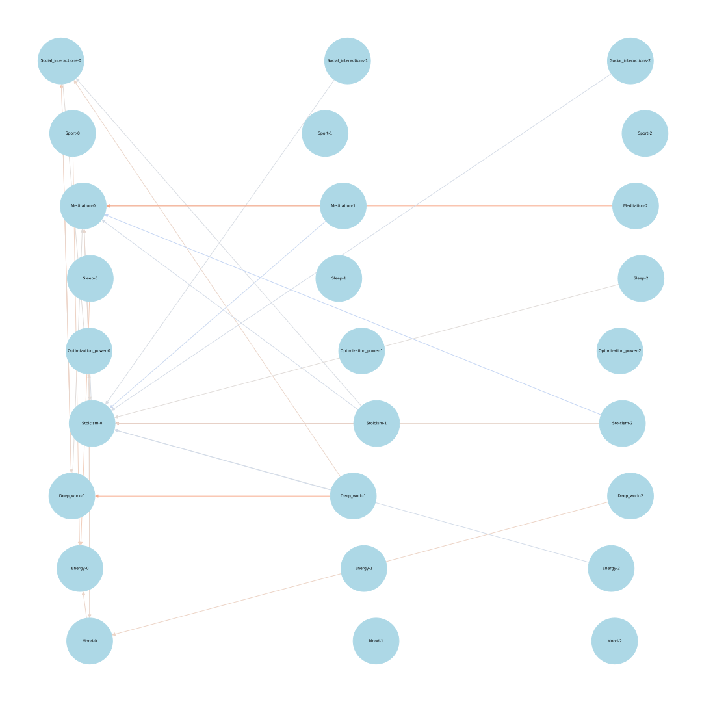

# CausalSelf

After reading Causality: Models, Reasoning and Inference I was curious to apply causal discovery to some real-world data that is meaningful to me. So I took the numbers from my habit tracker and decided to find causal relations between different habits and metrics.

I tried different algorithms from `gcastle` library, and to test them I wrote a dummy model that generated data with known relations (`dummy_data.py`). First, I learned that 140 samples is often not enough. Also, some algorithms can't incorporate prior knowledge about time direction, or don't provide effect sizes.

I ended up using `DirectLiNGAM`, it worked well enough. Also, to reduce noise, I averaged effect sizes for the same time lag (e.g. relation of today to yesterday should be absolutely the same as yesterday to the two day ago).

## Results

Here the rows are {cause} -(lag)-> {effect}: {size}.

```
Deep_work -(1)-> Deep_work: 0.4032791100405615
Deep_work -(0)-> Meditation: 0.021900339356322115
Deep_work -(2)-> Mood: 0.13161783398362825
Deep_work -(0)-> Social_interactions: 0.29856860744298025
Deep_work -(1)-> Social_interactions: 0.1072442317446295
Deep_work -(1)-> Stoicism: -0.046209934742893095
Energy -(2)-> Stoicism: -0.08501401455460526
Meditation -(1)-> Meditation: 0.11302870893937525
Meditation -(2)-> Meditation: 0.4252275105471375
Meditation -(1)-> Stoicism: -0.1373565001871791
Mood -(0)-> Energy: 0.11274166330773049
Mood -(0)-> Optimization_power: 0.06342695667678179
Optimization_power -(0)-> Meditation: 0.09213378539179674
Optimization_power -(0)-> Mood: 0.0889551541470089
Sleep -(0)-> Energy: 0.18335049835685524
Sleep -(2)-> Stoicism: 0.02613188486132901
Social_interactions -(0)-> Deep_work: 0.07272796429234418
Social_interactions -(0)-> Stoicism: 0.02662760391682933
Social_interactions -(1)-> Stoicism: -0.044788788168426574
Social_interactions -(2)-> Stoicism: -0.06669414147004177
Sport -(0)-> Energy: 0.13451335108509602
Stoicism -(0)-> Meditation: -0.04185826638177498
Stoicism -(1)-> Meditation: -0.07386588082270684
Stoicism -(2)-> Meditation: -0.1753810491249338
Stoicism -(1)-> Social_interactions: -0.032838955313583884
Stoicism -(1)-> Stoicism: 0.6774202228297719
Stoicism -(2)-> Stoicism: 0.08467536095939389
```

Or, visualizing only the causes of today:
